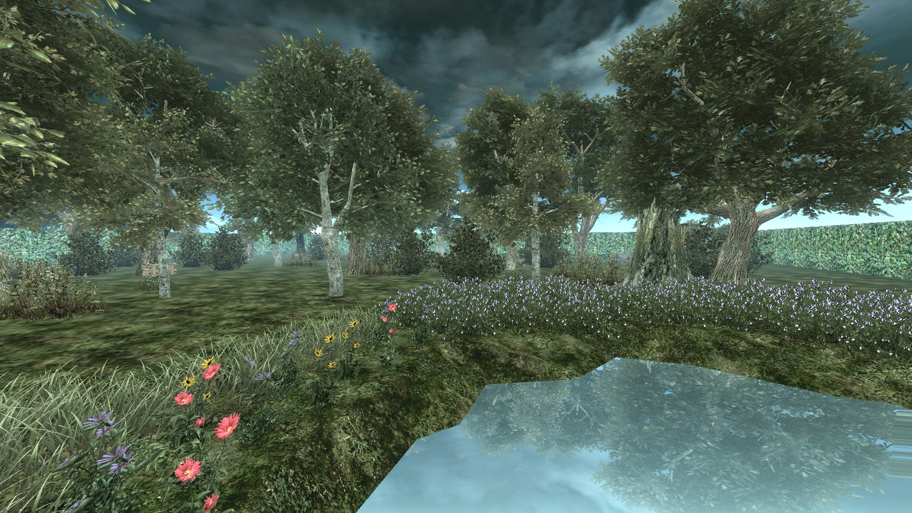
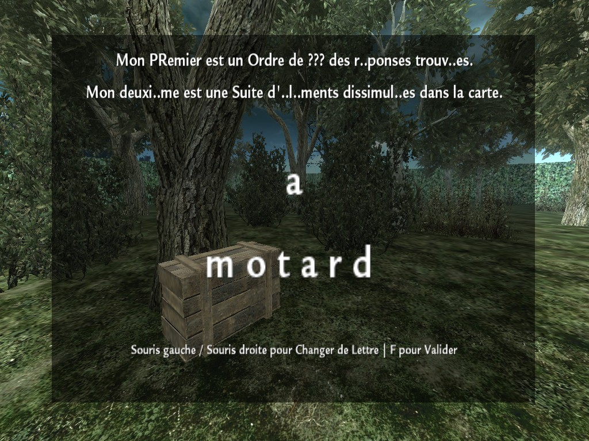
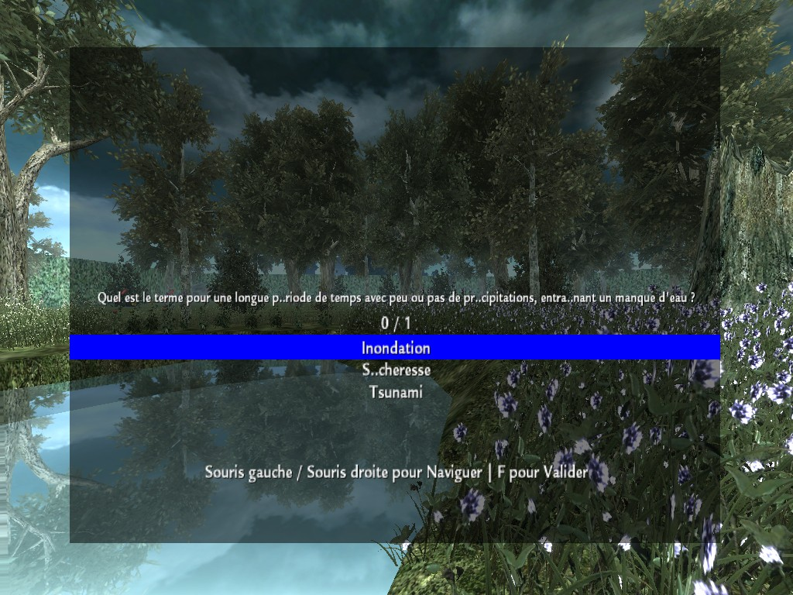
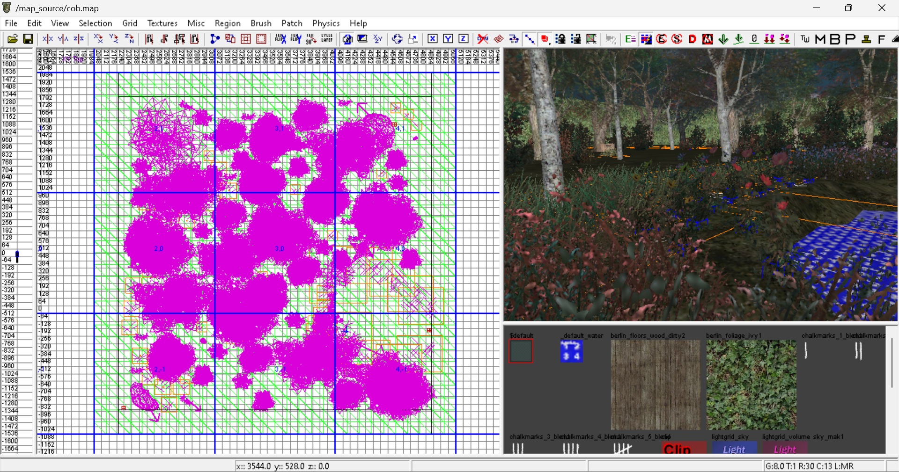

<a name="readme-head">

    <h1 id="readme-title">Chef d’Œuvre Baccalauréat (C.O.B.) - Projet Inachevé</h1>
    <h4 id="readme-description">Jeu-Vidéo sur le Thème de l’Écologie sous forme de « Quiz » (Question – Réponse) à l’aide de Menus de Sélection et d’Indices disponible à Différent Endroit de l’Environnement 3D lié à des Objets ou Autres permettant de Résoudre une Énigme se Résolvant par un Mot à Trouvé Ouvrant un Coffre au Trésor délivrant un Certificat de Réussite félicitant le joueur de la part des Contributeurs du Projet ainsi que de tout l'Équipe Éducatif du Lycée Denis Diderot à Bavilliers.</h4>
    <h3>La <strong>Version</strong> <code>Compilé</code> est <strong>Téléchargeable</strong> sur <a href="https://drive.google.com/uc?export=download&id=1oYSs7cHtCxymiTsT6Tr6KMiCqdkesjkK">Google Drive</a> en raison des <strong>Limitations</strong> de <code>Github</code></h3>
    
    
    
    
    
    
    
    
    
    
    
    
    
    
    
    
    
    
    
    

</a>
<a name="readme-body">

    
    
    
    

</a>
<a name="readme-footer">
CL 2024 <a id="readme-footer-repo" href="https://github.com/AmandAlexandrePro/COB">COB</a> &lt;/&gt; et 🖼 avec ❤ par <a id="readme-footer-author" href="https://github.com/AmandAlexandrePro">AMAND Alexandre</a> et les <a id="readme-footer-contributors" href="https://github.com/AmandAlexandrePro/COB/graphs/contributors">contributeurs</a>.
</a>
